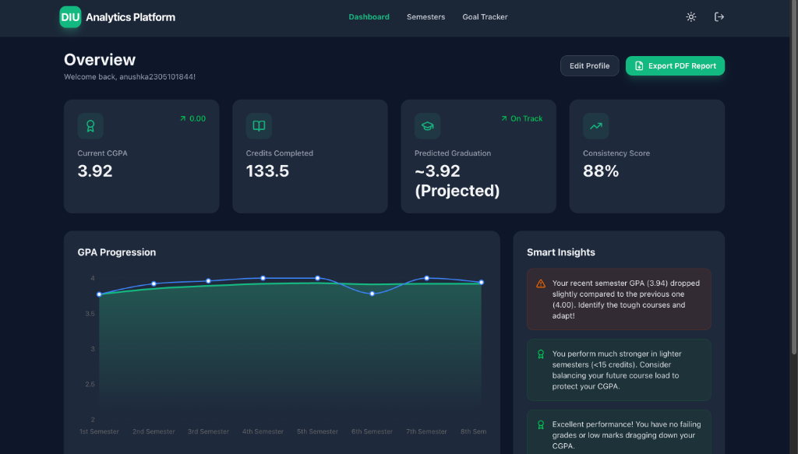
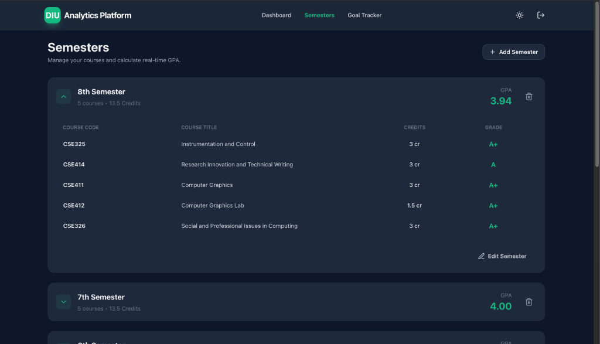
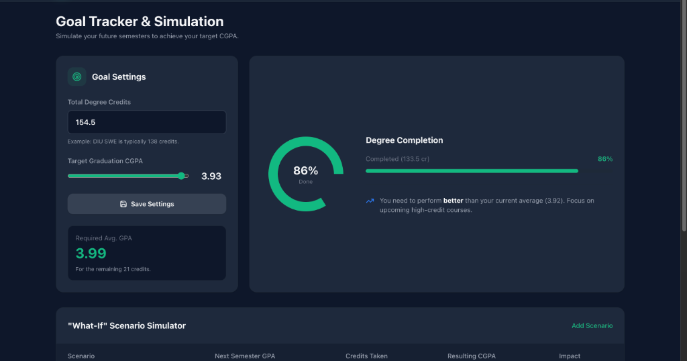
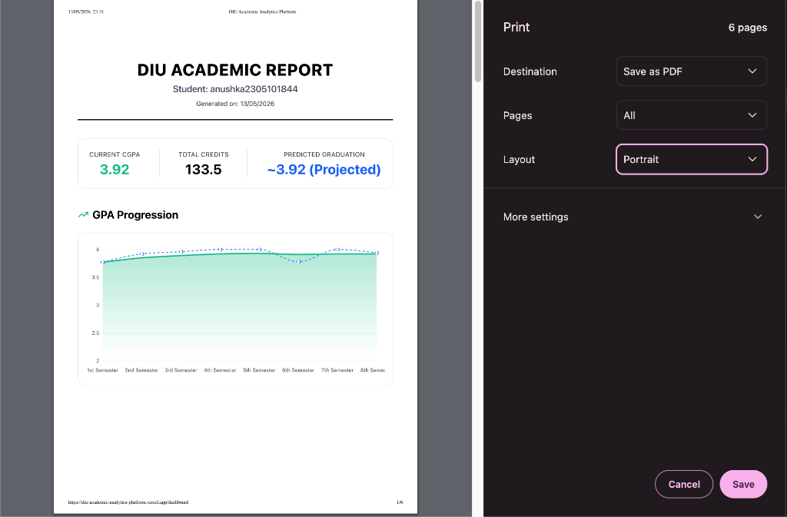
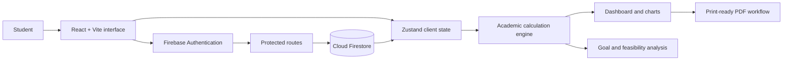

# DIU Academic Analytics Platform

[](https://diu-academic-analytics-platform.vercel.app/)
[](https://react.dev/)
[](https://firebase.google.com/)
[](https://vite.dev/)

A cloud-backed academic planning and analytics application for Daffodil International University students. The platform converts course-level grades into weighted semester GPA and cumulative CGPA, visualizes academic progress, evaluates target-CGPA feasibility, and produces a print-ready academic summary.

> **Project scope:** This is an independent student project and is not an official DIU system. Its goal calculations are deterministic mathematical projections—not machine-learning predictions or official academic advice.

## Live Application

**Deployment:** [diu-academic-analytics-platform.vercel.app](https://diu-academic-analytics-platform.vercel.app/)

Authentication is limited in the interface to DIU student and faculty email domains. Visitors without an eligible account can still review the public landing, features, and FAQ pages.

## Problem and Motivation

Semester-wise result pages make it difficult for students to answer broader planning questions:

- What is my credit-weighted CGPA across all recorded semesters?
- How has my performance changed over time?
- What average GPA would I need across my remaining credits to reach a target CGPA?
- Is that target mathematically achievable under a 4.00 grading scale?
- How would one hypothetical semester affect my cumulative result?

This platform brings those calculations into one responsive workspace with authenticated cloud persistence.

## Implemented Features

- Email/password authentication through Firebase Authentication
- Password-reset flow and protected application routes
- Firestore persistence scoped to the authenticated user's document
- Semester and course creation, editing, deletion, and cloud saving
- DIU 4.00-scale grade selection and credit-weighted GPA/CGPA calculation
- GPA and cumulative-CGPA progression charts
- Rule-based insights derived from recent performance, course grades, and credit load
- Configurable degree-credit and target-CGPA settings
- Required-average-GPA and maximum-achievable-CGPA calculations
- Predefined what-if scenarios for a future 15-credit semester
- Print-optimized academic report export through the browser's PDF workflow
- Responsive light/dark interface and keyboard command palette

## Application Preview

### Landing page


### Analytics dashboard



### Semester and course management



### Target-CGPA planning



### Print-ready report



## System Architecture



The application uses Firebase as a managed backend service. React handles the presentation and calculation layers; Zustand coordinates client state; authenticated user records are loaded from and saved to Firestore.

## Academic Calculations

For course credit \(c_i\) and grade point \(g_i\), semester GPA is calculated as:

```text
semester GPA = sum(c_i * g_i) / sum(c_i)
```

Cumulative CGPA uses the same credit-weighted calculation across all saved courses:

```text
CGPA = total earned grade points / total completed credits
```

Given target CGPA \(T\), degree credits \(D\), current CGPA \(C\), and completed credits \(K\), the required average over the remaining credits is:

```text
required GPA = (T * D - C * K) / (D - K)
```

If the required result exceeds 4.00, the interface marks the target as mathematically infeasible and reports the maximum CGPA achievable by earning 4.00 in every remaining credit.

## Technology Stack

| Layer | Technology | Responsibility |
|---|---|---|
| Interface | React 19, React Router | Component UI, navigation, protected pages |
| Build tooling | Vite 8 | Development server and production bundling |
| Styling | Tailwind CSS 4 | Responsive layout and light/dark themes |
| State | Zustand | Authentication-linked and academic UI state |
| Authentication | Firebase Authentication | Email/password accounts and password reset |
| Persistence | Cloud Firestore | Per-user semesters and goal settings |
| Visualization | Recharts | GPA, CGPA, and completion charts |
| Interaction | Framer Motion, React Hot Toast | Transitions and user feedback |
| Reporting | Browser print stylesheet | Print/PDF academic summary |
| Deployment | Vercel | Frontend hosting |

## Repository Structure

```text
DIU-Academic-Analytics-Platform/
├── public/
│   └── screenshots/          # README and application screenshots
├── src/
│   ├── assets/               # Static application assets
│   ├── components/           # Authentication, navigation and shared UI
│   ├── layouts/              # Authenticated application shell
│   ├── lib/
│   │   └── firebase.js       # Firebase client initialization
│   ├── pages/                # Public and authenticated route pages
│   ├── store/
│   │   └── useStore.js       # Zustand state container
│   ├── App.jsx               # Routes and application providers
│   ├── index.css             # Global styles and print rules
│   └── main.jsx              # React entry point
├── eslint.config.js
├── index.html
├── package.json
├── package-lock.json
└── vite.config.js
```

## Local Setup

### Prerequisites

- Node.js compatible with Vite 8
- npm
- A Firebase project with Email/Password Authentication and Cloud Firestore enabled

### 1. Clone the repository

```bash
git clone https://github.com/anushka06onu/DIU-Academic-Analytics-Platform.git
cd DIU-Academic-Analytics-Platform
```

### 2. Install dependencies

```bash
npm install
```

### 3. Configure Firebase

Create `.env.local` in the project root:

```env
VITE_FIREBASE_API_KEY=your_api_key
VITE_FIREBASE_AUTH_DOMAIN=your_project.firebaseapp.com
VITE_FIREBASE_PROJECT_ID=your_project_id
VITE_FIREBASE_STORAGE_BUCKET=your_project.firebasestorage.app
VITE_FIREBASE_MESSAGING_SENDER_ID=your_sender_id
VITE_FIREBASE_APP_ID=your_app_id
VITE_FIREBASE_MEASUREMENT_ID=your_measurement_id
```

Do not commit environment files. Firebase client configuration does not replace server-side authorization; deploy restrictive Firestore Security Rules before storing user data.

### 4. Start development

```bash
npm run dev
```

### 5. Quality checks

```bash
npm run lint
npm run build
```

## Data Model

Academic data is stored under one document per authenticated user:

```text
users/{uid}
├── semesters[]
│   ├── id
│   ├── name
│   ├── expanded
│   └── courses[]
│       ├── id
│       ├── code
│       ├── title
│       ├── credit
│       └── grade
├── degreeCredits
└── targetCgpa
```

Production Firestore rules should ensure that a user can read and write only `users/{theirUid}`. Domain restrictions should also be enforced through trusted backend rules or claims if institutional-only access is a security requirement; client-side suffix checks alone are not sufficient authorization.

## Current Limitations

- Retakes, waived courses, transfer credits, incomplete grades, and institution-specific replacement policies are not modeled.
- The predefined what-if table uses a fixed 15-credit next semester.
- PDF output relies on the browser print dialog rather than a dedicated report service.
- The project does not integrate with DIU's official student portal or automatically import academic records.
- It provides planning support only; students should verify official results and degree requirements through authorized university channels.

## Recommended Roadmap

- Replace placeholder dashboard statistics with calculated values or remove them
- Add editable what-if scenarios and multiple-semester planning
- Add schema validation and clearer handling of credits beyond the configured degree total
- Add import/export for a portable user-owned JSON or CSV backup
- Add automated tests for GPA, target feasibility, authentication boundaries, and Firestore operations
- Add accessibility checks, error boundaries, and empty/offline states
- Publish and document least-privilege Firestore Security Rules
- Add a privacy notice and account-data deletion workflow

## Responsible Use and Privacy

This application stores manually entered academic records. Do not enter credentials from the official DIU portal or upload confidential documents. The application is not affiliated with or endorsed by Daffodil International University, and its calculations are not official transcripts or academic decisions.

## Author

Developed by **Fateha Hossain Anushka**.

- [GitHub](https://github.com/anushka06onu)
- [Portfolio](https://fatehahossainanushka.vercel.app/)

## License

No open-source license is currently included in the repository. Unless a license is added, the source remains available for viewing but is not automatically licensed for reuse or redistribution.
